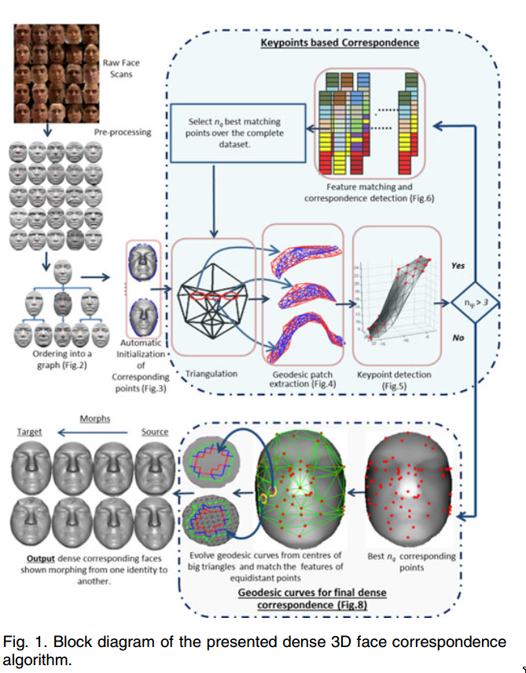

# Dense 3D Face Correspondence

This repository contains serial and parallel implementation of an algorithm taken from [Dense 3D Face correspondence](https://ieeexplore.ieee.org/abstract/document/7973095) paper that automatically establishes dense correspondences between a large number of 3D faces. Starting from automatically detected sparse correspondences on the outer boundary of 3D faces, the algorithm triangulates existing correspondences and expands them iteratively by matching points of distinctive surface curvature along the triangle edges.

* `serial.py` contains serial implementation of the algorithm.
* `serial.ipynb` contains serial implementation with 3D plots and visualizations.
* `multi-processing.py` contains parallel implementation of the algorithm, it uses Python's inbuilt `multiprocessing` module. (~8x faster)
* `multi-threading.py` uses Python's inbuilt `multithreading` module, performs poorly because of [Python's GIL issue](https://stackoverflow.com/questions/10789042/python-multi-threading-slower-than-serial).

### Requirements

* [memcached](https://memcached.org/) (sudo apt install memcached)
* [pymemcached](https://pypi.org/project/pymemcache/) (pip install pymemcached)
**Note**: Before running `multi-processing.py` start the memcached deamon with `memcached -u memcached -d -m 1024 -I 128m -l 127.0.0.1 -p 1111`.

To know more about the implementation, refer to the original [Dense 3D Face Correspondence](https://ieeexplore.ieee.org/abstract/document/7973095) paper and the [report](https://docs.google.com/document/d/1_ZqUXhxQ7LuPAfbcRhzPF2yDY2vRiyeTPdZuQjAb520/) prepared for this project.

### Demo video:

### Team mates:
* [V. Hemanth Sai](https://github.com/Hemanth73)
* Rishabh Agrahari (that's meeee :sunglasses: )
* Pratyush Prateek Singh
* Utkarsh Ranjan
* Nitin Mahawar

